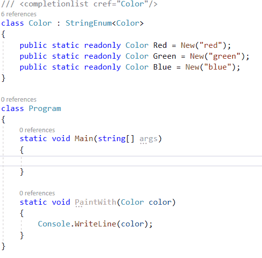

# StringEnum

StringEnum is a base class for creating string-valued enums in .NET. It is just one C# file that you can copy & paste into your projects, or install via NuGet package named [StringEnum](https://www.nuget.org/packages/StringEnum/).

## Usage:

``` csharp
///<completionlist cref="HexColor"/> 
class HexColor : StringEnum<HexColor>
{
    public static readonly HexColor Blue = Create("#FF0000");
    public static readonly HexColor Green = Create("#00FF00");
    public static readonly HexColor Red = Create("#000FF");
}
```

## Features

- Your StringEnum looks somewhat similar to a regular enum:

``` csharp
    // Static Parse Method
    HexColor.Parse("#FF0000") // => HexColor.Red
    HexColor.Parse("#ff0000", caseSensitive: false) // => HexColor.Red
    HexColor.Parse("invalid") // => throws InvalidOperationException

    // Static TryParse method.
    HexColor.TryParse("#FF0000") // => HexColor.Red
    HexColor.TryParse("#ff0000", caseSensitive: false) // => HexColor.Red
    HexColor.TryParse("invalid") // => null

    // Parse and TryParse returns the preexistent instances
    object.ReferenceEquals(HexColor.Parse("#FF0000"), HexColor.Red) // => true

    // Conversion from your `StringEnum` to `string`
    string myString1 = HexColor.Red.ToString(); // => "#FF0000"
    string myString2 = HexColor.Red; // => "#FF0000" (implicit cast)
```

- Intellisense will suggest the enum name if the class is annotated with the xml comment `<completionlist>`. (Works in both C# and VB): i.e.



### Installation

Either:

- Install [**StringEnum**](https://www.nuget.org/packages/StringEnum/) NuGet package, which is based on `.Net Standard 1.0` so it runs on `.Net Core` >= 1.0, `.Net Framework` >= 4.5, `Mono` >= 4.6, etc.
- Or copy [StringEnum.cs](StringEnum/StringEnum.cs) base class to your project. 
- For `Newtonsoft.Json` serialization support, copy this extended version instead. [StringEnum.cs](StringEnum.Sample.NewtonsoftSerialization/StringEnum.cs), or follow the steps explained [here](StringEnum.Sample.NewtonsoftSerialization/README.md) 


### Extensibility / Tips

- You may add implicit casting **from string to your StringEnum**, by binding the implicit cast operator to the Parse method in the target class.

    ``` csharp
    class Color : StringEnum<Color>
    {
        public static readonly Color Blue = Create("Blue");
        public static readonly Color Green = Create("Green");
        ...add members..

        // Add the following line
        public static implicit operator Color(string stringValue)
            => Parse(stringValue, caseSensitive: false);
    }

    // usage:
    Color x = "Blue"; // implicit cast will then run: Color.Parse("Blue", caseSensitive: false)
    // or given a method:
    void PaintWall(Color wallColor)
    // you can call
    PaintWall("Blue");
    ```

- To allow any string to be a casted as your StringEnum value, you may expose the Create() method as public:

    ``` csharp
    public new static MyEnum Create(string value) => StringEnum<MyEnum>.Create(value);
    ```

    Or implement a special implicit cast:

    ``` csharp
    public static implicit operator MyEnum(string stringValue) => TryParse(stringValue, true) ?? Create(stringValue);
    ```

    However, I wouldn't recommend to use the Create() method with user-entered strings, as they will be stored in memory in the internal `valueDict` dictionary used for Parse and TryParse.

- If your StringEnum member names are equal to the string value, you can use replace the string with `nameof(member name)`, so the string is inferred from the member itself. That way if you refactor the member name (i.e. Color.Blue -> Color.BLUE), the string will be changed too ("Blue" -> "BLUE").

    ``` csharp
        public static readonly Color Blue = Create(nameof(Blue)); // <-- use nameof(Blue) instead of "Blue" string literal
    ```
